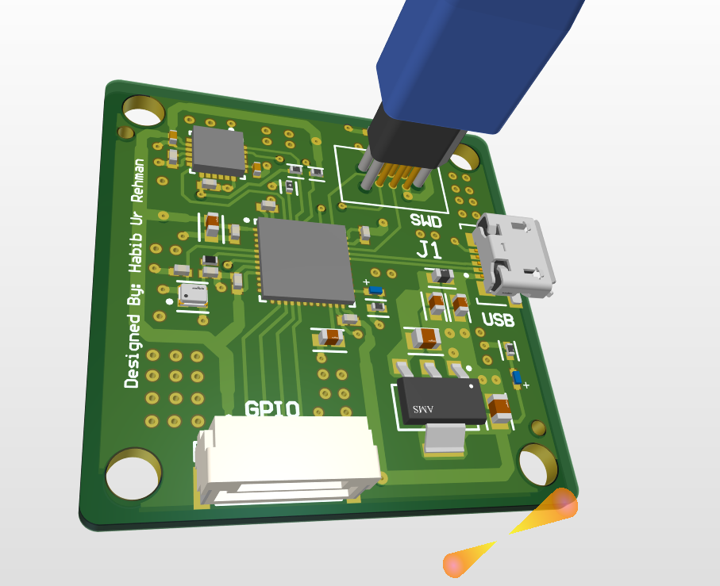
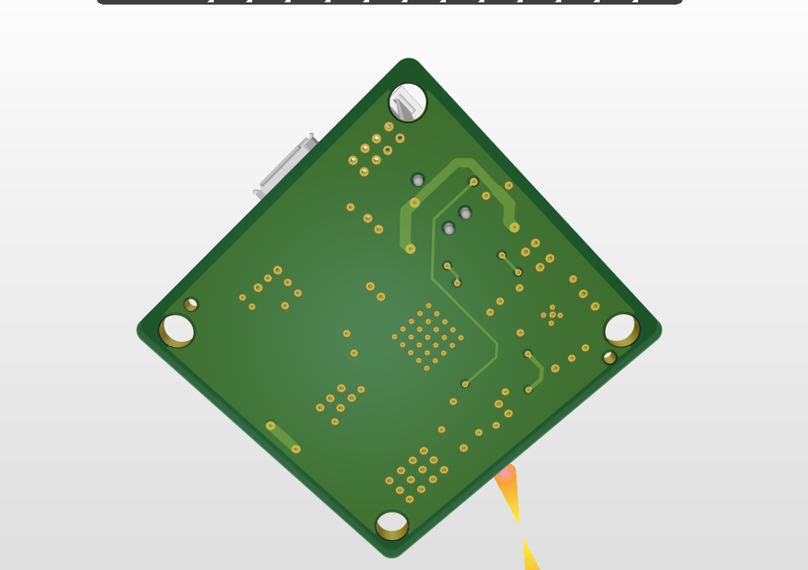
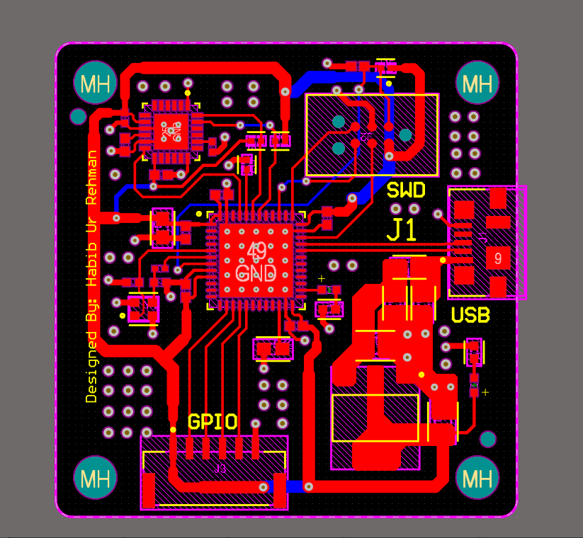
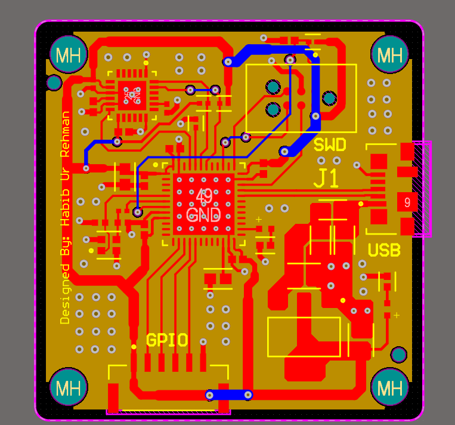

# STM32F411 IMU Development Board

<p align="center">
  
</p>

<p align="center">
  <strong>STM32F411CEU6 • MPU-6050 IMU • USB • SWD • 4-Layer PCB</strong>
</p>

<p align="center">
  A compact STM32F4-based development platform for embedded systems,
  motion sensing, and hardware development.
</p>

<p align="center">
  <a href="docs/schematics/STM32_Schematics.pdf">Schematic</a> •
  <a href="bom/STM32_PCB_BOM.csv">BOM</a> •
  <a href="manufacturing/gerbers/">Gerbers</a> •
  <a href="hardware/altium/">Altium Files</a>
</p>

---

## Overview

The **STM32F411 IMU Development Board** is a custom **4-layer embedded
development platform** built around the **STM32F411CEU6** microcontroller
and **MPU-6050 6-axis IMU**.

The board integrates a high-performance STM32F4 MCU, motion sensing,
USB connectivity, regulated 3.3 V power, SWD programming and debugging,
GPIO expansion, and I²C communication in a compact PCB design.

The complete hardware design package is included in this repository,
including the native **Altium Designer project**, schematic, PCB layout,
manufacturing Gerbers, drill files, BOM, and PCB documentation.

> **Status:** Design files and manufacturing outputs included.

---

## Quick Access

| Resource | Description |
|---|---|
| 📐 [Schematic PDF](docs/schematics/STM32_Schematics.pdf) | Complete electrical schematic |
| 📦 [Bill of Materials](bom/STM32_PCB_BOM.csv) | Component BOM |
| 🏭 [Gerber & Drill Files](manufacturing/gerbers/) | PCB manufacturing outputs |
| 🔧 [Altium Project](hardware/altium/) | Native Altium design files |
| 🖼️ [PCB Images](docs/images/) | 3D renders and PCB views |
| 🤝 [Contributing](CONTRIBUTING.md) | Contribution guidelines |

---

## Key Features

| Feature | Details |
|---|---|
| **Microcontroller** | STM32F411CEU6 |
| **IMU** | MPU-6050 6-axis accelerometer + gyroscope |
| **USB** | Micro-USB connectivity |
| **Power Input** | USB 5 V |
| **Voltage Regulation** | AMS1117-3.3 |
| **Programming / Debugging** | SWD |
| **IMU Interface** | I²C |
| **Expansion** | GPIO header |
| **Reset** | NRST |
| **Boot Control** | BOOT0 |
| **Clock** | 24 MHz crystal |
| **PCB** | 4-layer PCB |
| **EDA Software** | Altium Designer |
| **Manufacturing Data** | Gerber + drill files |
| **Documentation** | Schematic, PCB renders, layer views, and BOM |

---

## PCB Preview

### 3D Board Render

<p align="center">
  
</p>

### PCB Layout

<p align="center">
  
</p>

### PCB Layer View

<p align="center">
  
</p>

Additional board renders and PCB views are available in
[**docs/images/**](docs/images/).

---

## Schematic

The complete electrical schematic is available as a PDF:

### 📐 [View STM32F411 Schematic PDF](docs/schematics/STM32_Schematics.pdf)

The schematic includes:

- STM32F411CEU6 microcontroller
- MPU-6050 IMU
- USB interface
- 3.3 V power regulation
- 24 MHz crystal oscillator
- SWD programming/debug interface
- Reset circuitry
- BOOT0 control
- GPIO expansion
- Status indication
- Decoupling and supporting circuitry

---

## Bill of Materials

The current component BOM is available here:

### 📦 [View / Download STM32 PCB BOM](bom/STM32_PCB_BOM.csv)

The BOM contains the component information associated with the current
hardware design.

---

## Manufacturing Outputs

Manufacturing files are available under:

### 🏭 [Gerber & Drill Files](manufacturing/gerbers/)

The manufacturing package includes:

- Copper layers
- Solder mask layers
- Silkscreen layers
- Paste layers
- Board outline
- Plated drill files
- Non-plated drill files
- Assembly/component information where applicable

---

## Hardware Architecture

The board is organized into four primary functional blocks.

### 1. STM32F411CEU6 MCU

The **STM32F411CEU6** provides the main processing and control
functionality of the board.

### 2. MPU-6050 IMU

The **MPU-6050** provides:

- 3-axis accelerometer
- 3-axis gyroscope
- I²C communication

### 3. USB and Power

The power section includes:

- Micro-USB input
- USB 5 V supply
- Power filtering
- AMS1117-3.3 V voltage regulation

### 4. Debug and Expansion

The board provides access to:

- SWD programming/debugging
- GPIO
- NRST
- BOOT0
- I²C

---

## PCB Design

The board uses a **4-layer PCB** designed using **Altium Designer**.

The multilayer design provides a structured routing environment for
the MCU, IMU, USB interface, power distribution, and supporting
circuitry.

### PCB Characteristics

- 4-layer PCB
- Compact component placement
- Dedicated ground/power plane structure
- USB interface routing
- MCU decoupling
- IMU interface routing
- SWD programming interface
- GPIO expansion
- Power regulation
- 24 MHz clock circuitry

---

## Design Files

The native Altium Designer project is located in:

[**hardware/altium/**](hardware/altium/)

### Main Files

| File | Description |
|---|---|
| `STM32_PCB.PrjPcb` | Main Altium project |
| `STM32_PCB.PcbDoc` | PCB layout |
| `STM32_Schematics.SchDoc` | Schematic source |
| `STM32_PCB.OutJob` | Output job configuration |
| `STM32_PCB.BomDoc` | Altium BOM document |
| `STM32_PCB.PrjPcbStructure` | Project structure data |

---

## Getting Started

### Hardware Development

1. Install a compatible version of **Altium Designer**.
2. Clone this repository.
3. Open the Altium project:

```text
hardware/altium/STM32_PCB.PrjPcb
```

The native project files are organized within the repository structure
alongside the associated schematic, PCB, and project documents.

### PCB Fabrication

The generated manufacturing package is available in:

```text
manufacturing/gerbers/
```

The directory contains the Gerber and drill files associated with the
current PCB design.

---

## Repository Structure

```text
.
├── .github/
│   └── ISSUE_TEMPLATE/
│
├── hardware/
│   ├── altium/
│   │   ├── STM32_PCB.PrjPcb
│   │   ├── STM32_PCB.PcbDoc
│   │   ├── STM32_Schematics.SchDoc
│   │   ├── STM32_PCB.OutJob
│   │   ├── STM32_PCB.BomDoc
│   │   └── ...
│   │
│   └── cam/
│       └── ...
│
├── manufacturing/
│   └── gerbers/
│
├── bom/
│   └── STM32_PCB_BOM.csv
│
├── docs/
│   ├── images/
│   │   ├── 3d_1.png
│   │   ├── 3d_2.png
│   │   ├── 3d_3.png
│   │   ├── STM32_layout1.png
│   │   ├── STM32_layout2.png
│   │   ├── STM32_layout3.png
│   │   ├── STM32_layout4.png
│   │   └── STM32_layout5.png
│   │
│   └── schematics/
│       └── STM32_Schematics.pdf
│
├── .gitignore
├── CONTRIBUTING.md
├── LICENSE
└── README.md
```

---

## Project Status

| Item | Status |
|---|---|
| Schematic | ✅ Completed and verified |
| PCB Layout | ✅ Completed |
| PCB Layer Count | ✅ 4-layer |
| Altium Project | ✅ Included |
| BOM | ✅ Included |
| Gerber Files | ✅ Generated |
| Drill Files | ✅ Generated |
| Documentation | ✅ Included |

---

## Acknowledgements

The repository contains the complete hardware design package and
associated technical documentation for the STM32F411 IMU Development
Board.

The design package includes the schematic, PCB layout, Altium project
files, BOM, manufacturing outputs, and supporting documentation.

---

## Contributing

Contributions, suggestions, design reviews, and improvements are welcome.

Please read [`CONTRIBUTING.md`](CONTRIBUTING.md) before submitting changes.

For hardware revisions, clearly document:

- What was changed
- Why it was changed
- Affected components
- Schematic changes
- PCB changes
- Manufacturing changes
- Validation performed

---

## License

This project is licensed under the **MIT License**.

The complete license terms are available in the
[`LICENSE`](LICENSE) file in the root of this repository.

**Copyright © 2026 Habib Ur Rehman**

---

## Author

### Habib Ur Rehman

**Electronics Engineering**  

Embedded systems, PCB design, microcontrollers, electronics hardware,
and hardware development.

### Connect

- **GitHub:** [Habib-creater](https://github.com/Habib-creater)
- **LinkedIn:** [Habib Ur Rehman](https://www.linkedin.com/in/habib-ur-rehman-8321182b4/)


---

<p align="center">
  <strong>STM32F411 IMU Development Board</strong><br>
  Custom 4-Layer STM32F4 Embedded Hardware Platform
</p>
